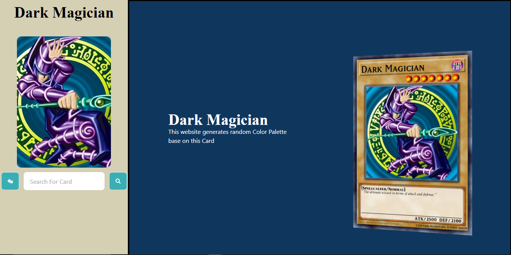

# YGO-Palette Generator

Welcome to the YGO-Palette Generator! This website creatively crafts color palettes inspired by Yu-Gi-Oh cards.

This project utilizes the ColorThief JavaScript package to elegantly extract color palettes from images. Additionally, it leverages the Yu-Gi-Oh free API to fetch card data. The magic happens as the cards are sent to the backend, where they are transformed into blob, and their vibrant colors are meticulously extracted.

The implementation of this process via the ExpressJS backend gracefully bypasses the CORS (Cross-Origin Resource Sharing) issue, which serves as a security measure to safeguard against unauthorized API calls from browsers.

<u style="color:blue;">[Live Demo](https://ygo-palette-client.vercel.app/)</u>

Let the creativity flow as you explore the enchanting world of Yu-Gi-Oh through color!
